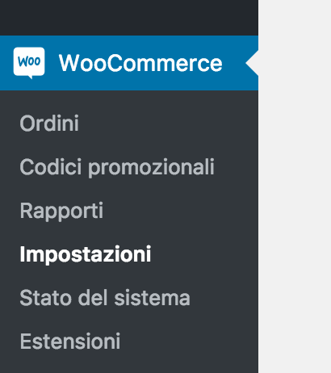
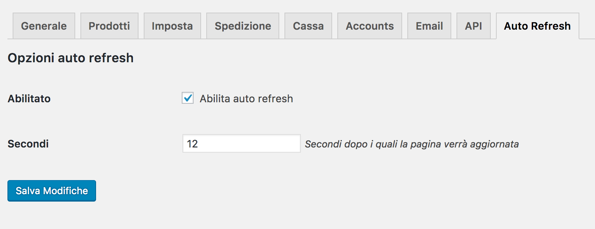

# woocommerce-auto-refresh-order
A little plugin for WooCommerce on Wordpress platform. Permit to automatically refresh the admin order page.

## Install
1. Download the woocommerce-auto-refresh-order.zip
2. Upload the plugin to the '/wp-content/plugins/' directory
3. Activate the plugin through the 'Plugins' menu in WordPress

## How to use
To use this plugin, go to woo commerce setting.

Simply enter the number of seconds you wish the page to refresh after in the box and enable it.

The admin order page will automatically refresh!
